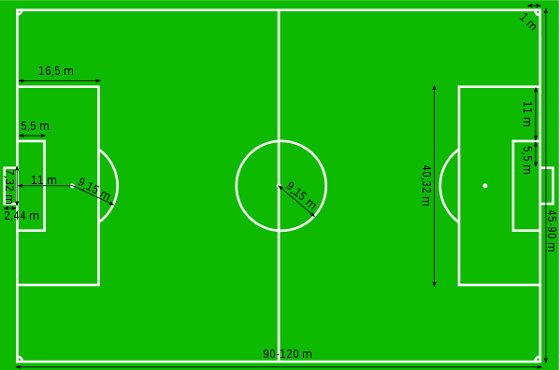

# Camera Calibration Experiments

Full breakdown and development of functions for projecting world points (2D and 3D) onto images of Brazil's most famous football stadium.

To compute the camera calibration parameters, the stadium's official field measurements were used:

